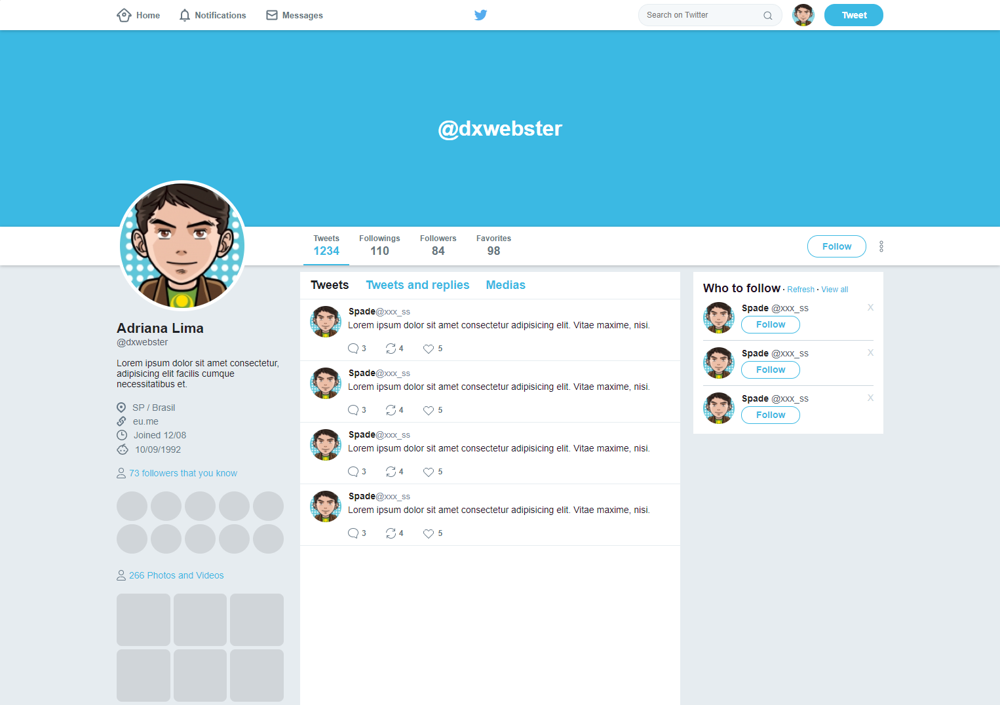

<p align="center">
  
  <br><br>
  Layout do Twitter feito utilizando Flexbox e Sass
  
  💻 **Acesse o Preview [aqui](https://dxwebster.github.io/Twitter-Flexbox)** | 
</p>

## 📥 Executar esse projeto no seu computador

- Clonar Repositório: `git clone https://github.com/dxwebster/Twitter-Flexbox`
- Entrar na pasta: `cd Twitter-Flexbox`
- Instalar dependências: `yarn install`

## 🚀 Tecnologias utilizadas

- HTML3
- CSS5 (Flexbox)
- Sass
- NodeJS
- Live Server

# Live Server

Para escrever nossos códigos e ter um live reload, utilizaremos a extensão Live Server para VSCode.
Mais informações do Plugin: https://github.com/ritwickdey/live-server-web-extension

# Sass

Vamos rodar o sass para compilar nossos arquivos pelo Node. Nosso arquivo 'package.json' contém um script que vai fazer o sass observar as alterações dos arquivos e compilar automaticammente nosso .scss em .css. Para rodar o sass, basta executar `yarn start`

```json
// package.json
{
  "devDependencies": {
    "sass": "^1.26.10"
  },
  "scripts": {
    "start": "yarn sass --watch scss/style.scss css/style.css"
  }
}
```

## 📕 Licença

Todos os arquivos incluídos aqui, incluindo este _README_, estão sob [Licença MIT](./LICENSE).<br>
Criado com ❤ por [Adriana Lima](https://github.com/dxwebster)
